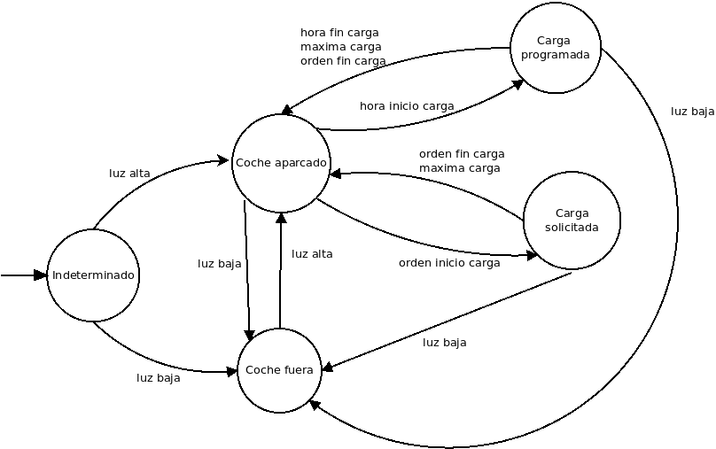

# Práctica 2
## Imeter: un cargador de Vehículos eléctricos

## Objetivos

El objetivo general del proyecto será la de automatizar la carga de un coche eléctrico en base a los precios de la electricidad por horas y la potencia contratada. 

## Implementación

La implementación de esta práctica se realiza en dos extremos: el control del cargador, que se realiza en el esp8266; y los clientes MQTT, que se ejecutan en la Raspberry Pi.

### Descripción de los módulos

La implementación de esta práctica se compone de varios módulos:

#### Modulo Cargador Inteligente:

Encargado de controlar el funcionamiento del cargador. Implementado en el esp8266, en el fichero [`practica2.ino`](https://github.com/AlmuHS/Practica_Arduino_MQTT/blob/main/practica2.ino)

##### Comunicaciones

Se suscribe a:

- Hora de inicio/fin de carga: */cargador/hora_inicio* y */cargador/hora_fin*
- Orden de carga (inicia aunque no sea la hora si hay coche): */cargador/orden_carga*. 
	+ 0 = esperar
	+ 1 = iniciar carga
	+ 2 = terminar carga
- Pregunta de potencia (para que el servidor calcule las horas de carga): */cargador/potencia_necesita*

Produce:

- Comienzo o fin de carga: */cargador/carga_inicia_fin*
- Coche llega/sale: */cargador/coche*
- Tiempo de carga: */cargador/coche_aparcado/tiempo_carga*

Periódicos:

- Desconectado/cargando (energía acumulada, tiempo de carga acumulado): */cargador/coche_aparcado/potencia_acum*
- Coche aparcado/no está: */cargador/estado_coche*
- Potencia instantánea (4kw): */cargador/potencia_instantanea*
- Potencia cargador: */cargador/potencia_cargador*

##### Funcionamiento

- El cargador recibe la orden de programar de una hora a otra o inmediatamente..
- Si el vehículo está presente , se enciende .Si no lo esta para.

La implementación consiste en una máquina de estados, siguiendo el siguiente diagrama

Inicialmente, el estado es indeterminado. En este estado se comprueba la luminosidad para determinar si el coche está aparcado o no lo está. Si la luminosidad es alta, se pasa al estado "coche aparcado", si es baja se pasa a "coche fuera".

Si el coche está aparcado, entonces se espera. Si el usuario da la orden de iniciar la carga, o si se llega a la hora de la carga programada, se inicia la carga. La carga continúa hasta que se cumpla alguna de estas 3 condiciones:

- El usuario da la orden de finalizar la carga
- La carga acumulada ha llegado al máximo
- En carga programada, se llega a la hora de finalización de carga
- El coche sale (la carga se interrumpirá)

Tras esto, si el coche no ha salido (en cuyo caso se volverá a "coche fuera"), se vuelve al estado de "coche aparcado". Si la luminosidad es baja, entonces se vuelve al estado de "coche fuera". En dicho estado, si la luminosidad es alta, se avanza al estado "coche aparcado".

##### Código

El código de la máquina de estados está implementado en el fichero [`maquina_estados.ino`](https://github.com/AlmuHS/Practica_Arduino_MQTT/blob/main/maquina_estados.ino). Este fichero implementa una clase con un método por cada estado (indeterminado, coche_fuera, coche_aparcado, carga_programada, carga_usuario) junto a algunos métodos auxiliares para realizar algunas tareas (carga, para realizar el proceso de carga; avanzar_estado, para avanzar en el máquina de estados; empezar_carga_programada y terminar_carga_programada, para iniciar o terminar la carga programada).

#### Sensor coche

Este sensor se encarga de informar sobre el porcentaje de carga de la batería y el tamaño total de la misma. Este se implementa como un script en la Raspberry Pi, en el fichero [`sensor_coche.py`](https://github.com/AlmuHS/Practica_Arduino_MQTT/blob/main/MQTT_modules/sensor_coche.py)

Dado que en este caso no disponemos de ningún sensor físico para obtener la información, obtendremos parte de la misma desde el propio cargador.

##### Comunicaciones

- Se suscribe:
	+ Potencia acumulada: *cargador/coche_aparcado/potencia_acum*

- Produce : 
	- % carga batería: *sensor/coche/carga*
	- Tamaño total batería: *sensor/coche/capacidad*

#### Sensor electrodoméstico:

Este sensor avisa cuando se pone en marcha un electrodoméstico, para comprobar si la potencia disponible en la instalación es suficiente para el cargador

Debido a que no disponemos de un sensor real, este lo simulamos mediante el script de bash [`sensor_electrodomestico.sh`](https://github.com/AlmuHS/Practica_Arduino_MQTT/blob/main/MQTT_modules/sensor_electrodomestico.sh) conectado a una tarea cron en determinadas franjas horarias.

##### Comunicaciones

- Produce: Potencia instantánea consumida: */sensor/electrodomestico*

#### Panel de mandos consola/web/APP:

Implementado en el fichero [`panel_mandos.py`](https://github.com/AlmuHS/Practica_Arduino_MQTT/blob/main/MQTT_modules/panel_mandos.py), se suscribe a los eventos del cargador y a los precios de la noche.

##### Comunicaciones

Se suscribe a :

- Carga del vehículo: 
- Estado de carga
- Hora de Comienzo
- Hora de Fin
- Energía acumulada/precio
- Precios de la noche (de 22 a 8)

#### Módulo de control

##### Comunicaciones

Se suscribe a:

- Orden directa de usuario: Parar/Comenzar carga
- Carga actual de vehículo
- Potencia cargador
- Potencia consumida instantánea

Produce:

- Orden de carga/parada
- Precios
- Hora comienzo/fin
- Pregunta potencia cargador

##### Funcionamiento

El servidor lee los precios a las 21:00, lee la carga del coche y decide cuantas horas necesita según la potencia del cargador entre las 00:00 y las 10:am. Se envía esta información (la utiliza el panel de datos , cargador y logger).

Para la carga de precios podéis utilizar el siguiente script en Python:
https://bit.ly/3qYJ8dp

Hay otros dispositivos conectados que consumen electricidad y producen un evento con cuanto están consumiendo (potencia instantánea). Si la suma de las potencias es superior a la potencia contratada (asumir 6 kw) emitirá al cargador una orden de parada , cuando vuelva a haber suficiente potencia se envía orden de reanudar la carga. No hay reajuste del numero de horas si esto ocurre.

#### Base de datos y logger

Se suscribe a todos los eventos. Implementado en el fichero [`logs.py`](https://github.com/AlmuHS/Practica_Arduino_MQTT/blob/main/MQTT_modules/logs.py)

Produce:
- Información por eventos

##### Funcionamiento

Graba en una base de datos o fichero todos los eventos y su origen con fecha y contenido. Puede usarse por un usuario externo o bien por un módulo para saber si algo ya ha ocurrido en un periodo de tiempo.

Por ejemplo si el cargador ha caído y queremos saber si ya había una hora de carga programada podría preguntar por este evento al logger para recuperar la información. En la práctica supondremos que los sistemas no caen y sólo se usará como debug.

### Comunicaciones

Las comunicaciones, como anteriormente se ha dicho, se realizan mediante el protocolo MQTT.

Como nodo central del sistema, se ha instalado un servidor Mosquitto dentro de la Raspberry Pi. Este servidor será el encargado de recibir los mensajes del cargador y otros módulos, y enviar las señales de control del cargador desde el módulo de control.

Para la conexión del cargador con el servidor, se utiliza la librería Adafruit_MQTT. En esta librería, cada suscripción está asociada a una función, que se ejecuta cuando se recibe la interrupción correspondiente a la misma. A su vez, cada publicación es un objeto, el cual se invoca para la publicación del mensaje.

La implementación de la comunicación MQTT del cargador con el servidor se implementa en el fichero [`mqtt.ino`](https://github.com/AlmuHS/Practica_Arduino_MQTT/blob/main/mqtt.ino)

### Ficheros

#### Esp8266

Por la parte del esp8266, disponemos de un proyecto Arduino IDE con 6 ficheros:

- practica2.ino: Fichero principal. Implementa la estructura principal del proyecto, con las funciones setup() y loop(), junto a algunas declaraciones de estructuras y objetos necesarios para el sistema.   

- maquina_estados.ino: Implementación de la máquina de estados  

- mqtt.ino: Funciones genéricas para el envío de mensajes MQTT, y declaraciones de objetos de publicaciones y suscripciones. 

- sensores.ino: Funciones para lectura de los sensores, media móvil y tabla lookup.

- wifi.ino: Funciones para la conexión a la red WiFi

- hora.ino: Funciones para la obtención de la hora actual, y la descomposición de cadenas "HH:MM" en hora y minuto.

#### Raspberry Pi

Por la parte de la Raspberry Pi, disponemos de una colección de scripts para el envío y recepción de mensajes MQTT, y la obtención del tramo horario mas barato.

- logs.py: Script de Python que implementa el módulo de logs mediante el módulo Paho MQTT
- modulo_control.py: Script de Python que implementa el módulo de control
- panel_mandos.py: Script de Python que implementa el panel de mandos
- pvpc.py: Script de Python que obtiene las horas mas baratas desde la API de la red eléctrica
- sensor_coche.py: Script de Python que implementa el módulo del sensor del coche

## Ejecución

Para poner en marcha el sistema, debemos cargar el fichero practica2.ino dentro del esp8266 y, una vez cargado, abrir el monitor serie.

### Circuitería

Para simular la entrada y salida del vehículo, utilizaremos un LDR y un diodo led, puestos frente a frente.
Cuando el led se apague (también se puede emular poniendo un papel grueso entre el led y el LDR), se considerará que el coche ha salido. Cuando el led se encienda, se considerará que el coche ha entrado.

Un posible esquema de conexionado será el siguiente:

### Monitor serie

Al iniciar el sistema, si el led está encendido (coche presente), veremos algo como esto

El monitor serie irá mostrando la hora actual, y una copia de los mensajes MQTT enviados y/o recibidos a los diferentes módulos

### Ordenar carga

Teóricamente, la carga se programa o se solicita desde el módulo de control. Pero, si queremos ordenar la carga manualmente, podemos realizarlo mediante la línea de comandos de mosquitto

Para ello, enviamos un mensaje al canal *usuario/cargador/orden_carga*. El mensaje será "1" para iniciar la carga, "2" para terminarla

	mosquitto_pub -h localhost -t usuario/cargador/orden_carga -m 1

Veremos algo parecido a esto

La carga continuará hasta que el usuario de la orden de terminar, o bien hasta que la batería se cargue completamente.

Esta carga asumirá que la batería es de 4 Kwh y que está vacía. Si queremos cambiar dicho valor, podemos indicar la potencia requerida, enviando otro mensaje a */usuario/cargador/potencia_necesita*. 

### Programar carga

De nuevo, la carga se debería programar automáticamente desde el módulo de control, programandola en el rango horario con la electricidad mas barata. 

Pero, si queremos probar el proceso manualmente, podemos programar la carga enviando los mensajes MQTT desde la línea de comandos a los canales *usuario/cargador/hora_inicio* y *usuario/cargador/hora_fin*.

La hora se envía en formato HH:MM. Por ejemplo:

	mosquitto_pub -h localhost -t usuario/cargador/hora_inicio -m 22:30
	mosquitto_pub -h localhost -t usuario/cargador/hora_fin -m 22:35

El monitor serie nos muestra el aviso indicando la hora de inicio y fin de la carga programada

Al llegar a la hora programada para el inicio de la carga, se nos indica que ha comenzado la carga, y se van mostrando mensajes periódicos indicando el progreso de la carga

Al llegar a la hora de fin de la carga, se nos muestra otro aviso indicando el fin de la carga, y se vuelve al estado de "coche aparcado"

### Uso del módulo de control

Para programar la carga mediante el módulo de control, debemos seguir los siguientes pasos.

En primer lugar, el módulo de control necesita saber la hora con la electricidad mas barata. Para ello, debemos ejecutar el script `pvpc.py`, que accederá a la API de la red eléctrica, obtendrá la hora mas barata y su precio, y escribirá ambos valores a un fichero llamado `hora`

Para ejecutar este script, debemos lanzar el comando

	python3 MQTT_modules/pvpc.py

En segundo lugar, el módulo de control también necesita tener acceso a la información de la capacidad de la batería. Esta información la da el sensor del coche. Por lo tanto, debemos lanzar el script correspondiente al sensor del coche para que el módulo de control funcione.

	python3 MQTT_modules/sensor_coche.py

Y, finalmente, para iniciar el módulo de control ejecutamos el script `modulo_control.py`

	python3 MQTT_modules/modulo_control.py
	
Este leerá la hora almacenada en el fichero `hora`, calculará el tiempo de carga en función de la carga actual, el tamaño de la batería, y potencia instantánea del cargador; y programará la hora de inicio y de fin de la carga según estos datos.

También podemos ver como el módulo de carga va recibiendo los eventos correspondientes a sus suscripciones

### Sensor del coche

El sensor del coche también irá registrando los mensajes correspondientes a la potencia acumulada, y publicando los correspondientes a la capacidad

